<p align="center">
  
</p>

# DeltaReview

DeltaReview is a fast, local-first interface for reviewing GitLab merge
requests. It reuses your existing `glab` authentication and keeps GitLab as
the source of truth.

> **Status:** Alpha.

## How it works


## Private by design


## Quick start

Requires [uv](https://docs.astral.sh/uv/) and an authenticated
[glab](https://gitlab.com/gitlab-org/cli) installation.

<details>
<summary>Install and authenticate glab</summary>

### Windows

```powershell
winget install glab.glab
```

Restart PowerShell after installing.

### macOS

```console
brew install glab
```

### Linux

Homebrew is the officially supported package manager:

```console
brew install glab
```

Alternatively, install the community-maintained Snap package:

```console
sudo snap install glab
```

Then authenticate with your GitLab instance:

```console
glab auth login --hostname gitlab.example.com
glab auth status --hostname gitlab.example.com
```

</details>

```console
uvx delta-review https://gitlab.com/group/project/-/merge_requests/42
```

## Current scope

DeltaReview reads text diffs and lets you create, reply to, resolve, and
unresolve GitLab discussions. If GitLab rejects a multiline position,
DeltaReview tries the last selected line and then posts a clearly labeled
general discussion. It does not submit approvals, batch reviews, or render
oversized/binary files.

## Development

```console
uv sync
npm ci --prefix web
uv run pytest
npm test --prefix web -- --run
npm run build --prefix web
```

---

Contributions are welcome through
[issues](https://github.com/jmoraispk/delta-review/issues) and pull requests.
DeltaReview is released under the [MIT License](./LICENSE).
