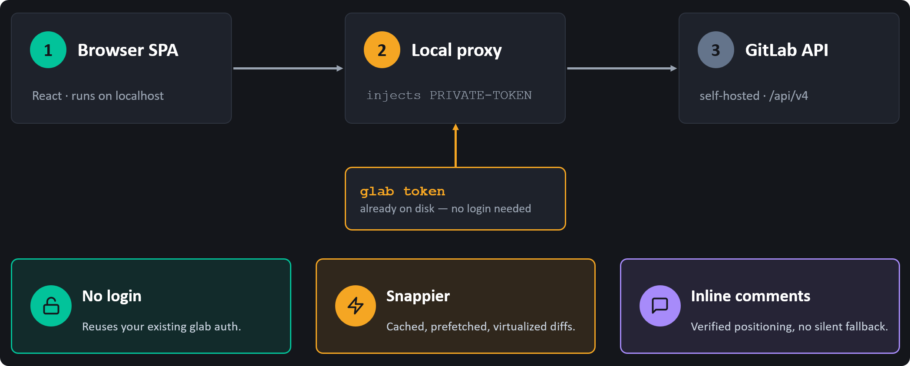
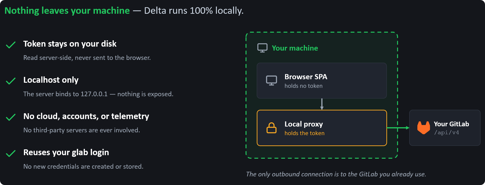

  

# delta-review

Delta is a local-first GitLab merge-request review interface designed to make
large diffs and inline discussions feel fast.

> **Status:** Design stage. The product direction and implementation plan are
> documented, but there is not yet an installable release.

## The review loop

Delta is focused on the work reviewers do repeatedly:

- navigate a virtualized file tree and unified or split diffs;
- read existing inline discussions;
- reply and resolve or unresolve threads; and
- select a line or range and post a verified inline comment.

GitLab remains the source of truth. Delta does not create a separate review
system, and the first release will not include batched reviews, approvals,
merge-request authoring, or pipeline controls.

## How it works

The browser talks only to a loopback FastAPI server. That server resolves the
current GitLab host and authentication through `glab`, calls the GitLab API,
and serves a prebuilt React interface. End users will run the Python package
with `uvx` and will not need Node.js or npm.

The concept image shows a self-hosted instance; the public architecture uses
the same flow for GitLab.com.

The public version is intended to support both GitLab.com and self-hosted
GitLab. It will feature-detect version-dependent APIs, prefer paginated diffs,
and verify that each new comment was actually anchored to the selected line.

## Private by design

The server binds only to `127.0.0.1`. The GitLab token stays server-side,
never enters the browser, and is never sent to a Delta-hosted service. Delta
will ship without accounts or telemetry.

In the privacy image, "nothing leaves your machine" means that nothing is sent
to a Delta-operated service. Delta still exchanges review data and comments
with the GitLab instance the user selects.

## Project direction

The planned public MVP uses:

- Python, FastAPI, httpx, and uvicorn for the local server;
- React, TypeScript, and Vite for the browser interface;
- TanStack Query and virtualization for responsive navigation; and
- `@git-diff-view/react` for unified and split diff rendering.

The repository and Python distribution are named `delta-review`. The interface
keeps the shorter Delta branding and installs `delta` as its console command.
The exact launch command will be documented once the package exists.

## Design resources

- [Original self-hosted product design](./design-doc.md)
- [Approved public-tool design](./docs/superpowers/specs/2026-07-16-delta-public-tool-design.md)
- [Public MVP implementation plan](./docs/superpowers/plans/2026-07-16-delta-public-mvp.md)
- [Original self-hosted concept presentation](./delta-assets/how-delta-works.pptx)
