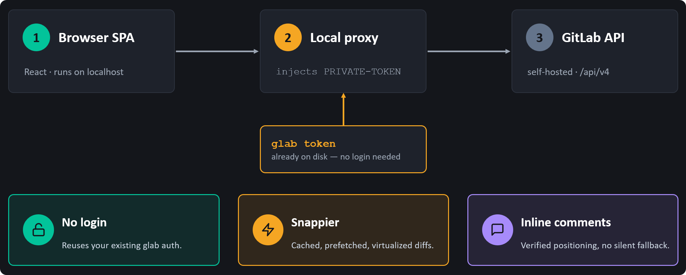
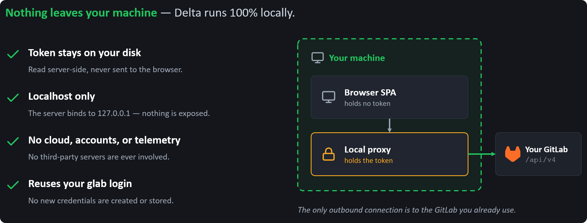

<p align="center">
  
</p>

# DeltaReview

DeltaReview is a fast, local-first interface for reviewing GitLab merge
requests. It reuses your existing `glab` authentication and keeps GitLab as
the source of truth.

> **Status:** Alpha.

## How it works



## Private by design



## Quick start

Requires [uv](https://docs.astral.sh/uv/) and an authenticated
[glab](https://gitlab.com/gitlab-org/cli) installation. Setting `GITLAB_TOKEN`
takes precedence and skips `glab` entirely.

<details>
<summary>Install and authenticate glab</summary>

### Windows

```powershell
winget install glab.glab
```

Restart PowerShell after installing.

### macOS

```console
brew install glab
```

### Linux

Homebrew is the officially supported package manager:

```console
brew install glab
```

Alternatively, install the community-maintained Snap package:

```console
sudo snap install glab
```

Then authenticate with your GitLab instance:

```console
glab auth login --hostname gitlab.example.com
glab auth status --hostname gitlab.example.com
```

</details>

```console
uvx delta-review https://gitlab.com/group/project/-/merge_requests/42
```

## Browser extension

DeltaReview also runs as a browser extension in Chrome, Edge and Firefox, with
no local Python required. It adds a toolbar hub listing merge requests awaiting
your review, and opens the same review interface in a tab.

There is no extension store. Everything comes from one page, which detects your
browser and operating system and shows a single path:

[Install DeltaReview](https://jmoraispk.github.io/delta-review/install/)

> **Not published yet.** No signing key exists, so no release carries the
> extension assets and that link has nothing to hand out. It starts working
> once a maintainer completes
> [docs/extension-release.md](./docs/extension-release.md).

After installing, open Settings and add your GitLab host with a personal access
token scoped to `api`. The token is stored locally and only ever sent to the
hosts you add. This is the one thing the extension needs that the command line
does not: the CLI reads a token from `GITLAB_TOKEN`, or from `glab` when that
variable is unset.

### Updates

Installs made from the install page update themselves. The signed Firefox
`.xpi` carries an `update_url`, and the Chrome and Edge policy install writes
one into the registry. Both point at an update manifest published as an asset
on the latest GitHub release, each browser polls it on its own schedule, and
the upgrade happens silently. Nothing is downloaded by hand after the first
install.

Two consequences:

- The Chrome zip is the exception. It exists for machines where policy installs
  are blocked, and it does not update itself — a new version means downloading
  and loading the zip again.
- The repository has to stay publicly reachable. Update checks run inside the
  browser and cannot authenticate, so making the repository private stops every
  installed copy from updating, without reporting anything.

### Building and loading it yourself

Loading unpacked from a local build is the development loop, not a way to use
DeltaReview day to day.

```console
npm run build:extension --prefix web
```

Chrome and Edge: `chrome://extensions` → Developer mode → Load unpacked →
`web/dist-extension/chrome`. Press Reload on the extension card after each
rebuild.

Firefox: `about:debugging#/runtime/this-firefox` → Load Temporary Add-on →
`web/dist-extension/firefox/manifest.json`. Press Reload after each rebuild.
Firefox drops temporary add-ons when it restarts.

While actually working on the extension, run the watch build instead:

```console
npm run dev:extension --prefix web
```

That rebuilds both targets on every save, and it puts a "Reload extension"
button in the hub header, which reloads the unpacked extension from disk
without the trip to `chrome://extensions`. Load unpacked once as above and the
loop becomes save, click, look. Reloading tears down every page the extension
owns, the hub included, so reopen it from the toolbar icon if the tab closes or
stops responding.

The button exists only in development builds — it is compiled out of everything
`npm run build:extension` produces. On a packaged or released install it is not
there, and the manual Reload above is still the way.

Chrome and Edge derive an unpacked extension's ID from the folder it was loaded
from, so moving or deleting that folder breaks it — that is what "file not
found" on `edge://extensions` means. Loading it again from a different path
produces a different ID and therefore empty storage, and the GitLab host and
token have to be added again. Signed and policy installs are unaffected: their
ID comes from the signing key. Publishing also puts that key's public half in
`manifest.base.json`, which gives unpacked builds the same fixed ID.

[docs/extension-smoke.md](./docs/extension-smoke.md) is the manual checklist to
work through against a build.

### Shipping a release

Bump `version` in `web/src/extension/manifest.base.json`, commit, then tag
`vX.Y.Z` and push the tag. The `extension` workflow builds both targets, packs
the CRX, signs the XPI, regenerates both update manifests, and attaches all
five assets to the release. It fails immediately if the tag and the manifest
version disagree, and refuses to run at all while
`web/src/extension/id.json` still holds its placeholder — so the one-time setup
in [docs/extension-release.md](./docs/extension-release.md) has to come first.

## Current scope

DeltaReview reads text diffs and lets you create, reply to, resolve, and
unresolve GitLab discussions. If GitLab rejects a multiline position,
DeltaReview tries the last selected line and then posts a clearly labeled
general discussion. It does not submit approvals, batch reviews, or render
oversized/binary files.

## Development

```console
uv sync
npm ci --prefix web
uv run pytest
npm test --prefix web -- --run
npm run build --prefix web
```

---

Contributions are welcome through
[issues](https://github.com/jmoraispk/delta-review/issues) and pull requests.
DeltaReview is released under the [MIT License](./LICENSE).
